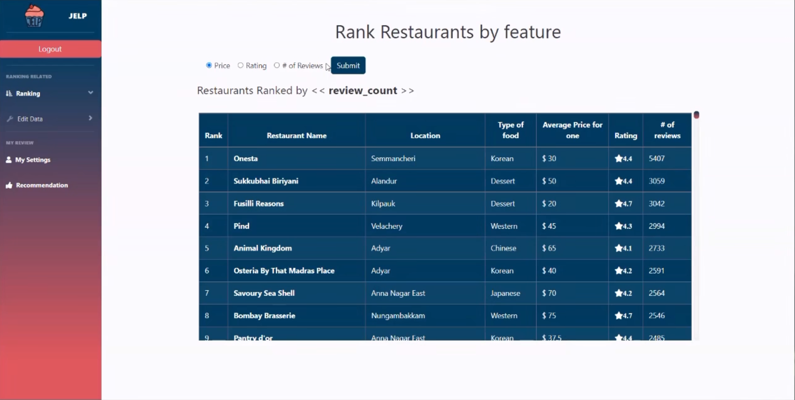

# Jelp 🍽️  
Restaurant Recommendation and Analysis Website

---

## 📌 Overview

**Jelp** is a members-only restaurant recommendation platform that provides useful information on restaurants.  
Users must log in to access the website. Once logged in, they can rank restaurants, filter by allergens, and manage detailed award data — including adding, updating, or deleting entries.

---

## 🔧 Key Features

- User sign up and login system
- Rank restaurants by various features
- Filter restaurants based on allergen information
- Add, update, and delete award data

---

## 🛠️ Tech Stack

- **Frontend:** HTML, CSS, JavaScript
- **Backend:** PHP, Python
- **Database:** SQLite
- **UI Framework:** Bootstrap

---

## 💿 Database Schema & ER Diagram

---

## ⚙️ PHP Code Structure Overview

---

## 📸 Website Demonstration

---

## 📘 What I Learned

- Built a fully functional web service using PHP for server-side scripting.
- Designed and implemented a database schema from scratch for a real-world CRUD application.
- Applied big data concepts to manage and filter large sets of restaurant data efficiently.
- Implemented CRUD operations (Create, Read, Update, Delete) in a big data context.
- Developed filtering mechanisms for allergens and restaurant features to support data-driven user personalization.

---

## 🔗 Links

- [Demo Video](https://youtu.be/R-_aP4gq6bA)
